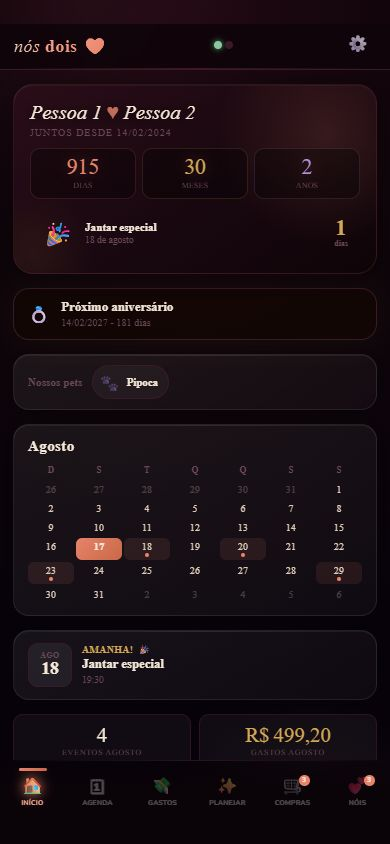
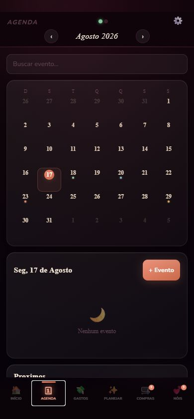
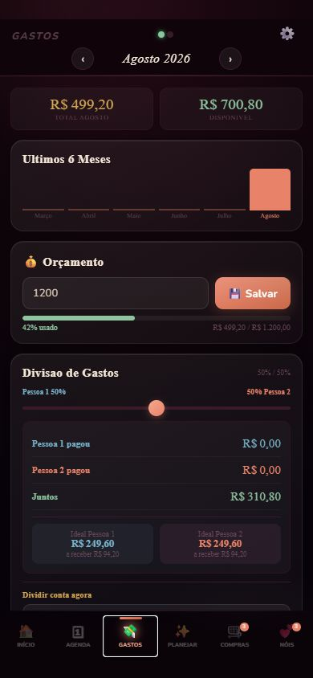
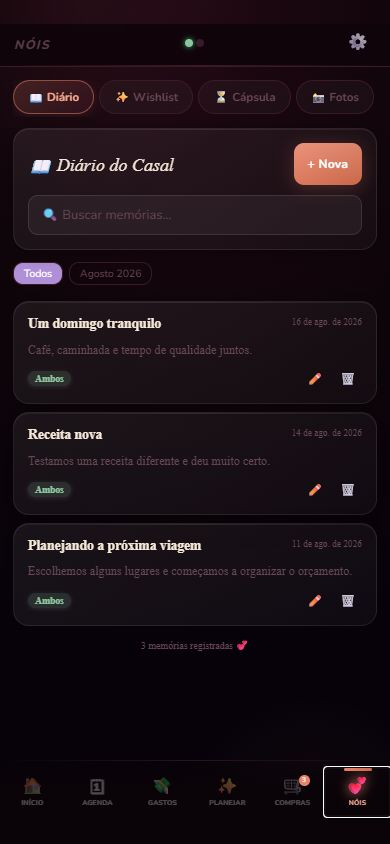
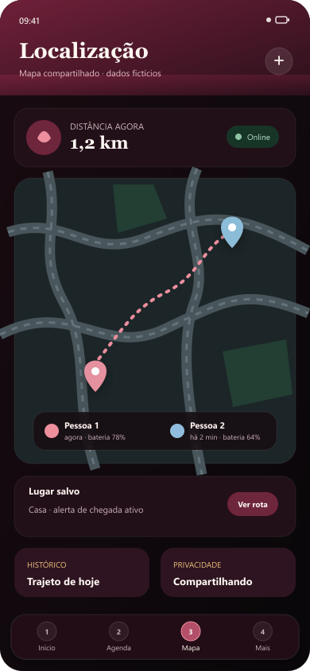
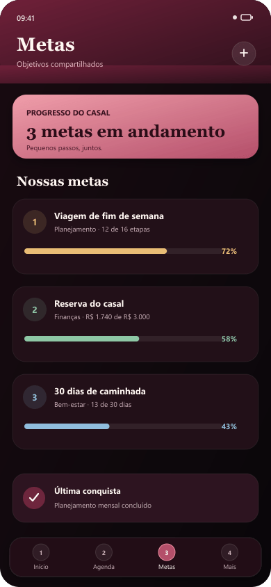
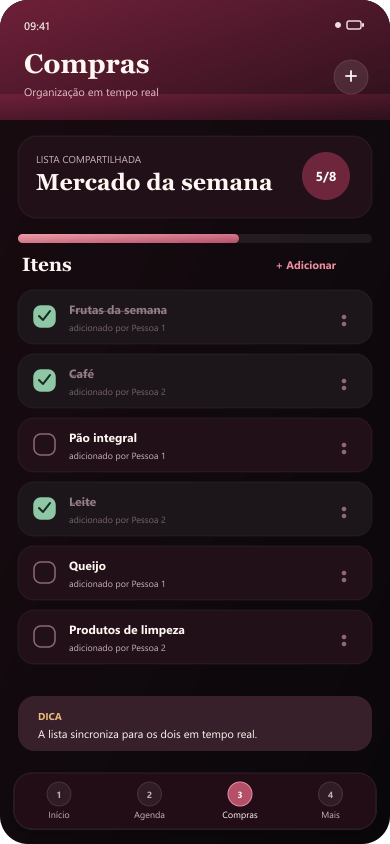
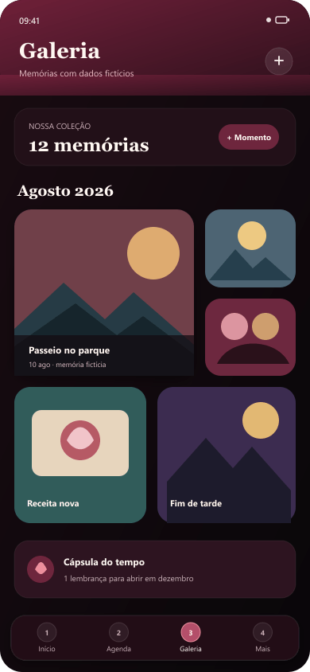

# Nós Dois

[](https://github.com/victorhugo-ml/nois-dois-app/actions/workflows/ci.yml)

Projeto pessoal que idealizei por hobby para mim e minha namorada organizarmos rotina, finanças, metas, memórias, eventos e localização compartilhada. A aplicação resultante funciona na web, como **PWA** e no **Android/Capacitor**, com autenticação, sincronização em tempo real, notificações e recursos nativos.

> Este repositório é uma versão pública e sanitizada para portfólio. As telas abaixo usam somente dados fictícios; as demonstrações de localização, metas, compras e galeria foram recriadas visualmente para não expor capturas do ambiente privado.

## Origem, autoria e uso de IA

A maior parte da implementação original foi produzida por ferramentas de IA generativa em ciclos conduzidos por mim. Meu trabalho concentrou-se em definir o problema e os fluxos, priorizar funcionalidades, descrever comportamentos esperados, testar o aplicativo, avaliar os resultados e solicitar refinamentos.

Ao preparar esta versão pública, também conduzi a sanitização dos dados, a organização da documentação, a inclusão de verificações automatizadas e a evolução incremental da base. Decidi publicar o projeto porque achei interessante documentar um experimento pessoal real e mostrar como coordeno, testo e avalio um processo assistido por IA - não para me apresentar como desenvolvedor frontend ou backend.

## Visão do produto

<table>
  <tr>
    <td align="center">
      <br>
      <sub><b>Início</b> — resumo do casal e próximos eventos</sub>
    </td>
    <td align="center">
      <br>
      <sub><b>Agenda</b> — calendário e compromissos compartilhados</sub>
    </td>
    <td align="center">
      <br>
      <sub><b>Gastos</b> — orçamento, divisão e acompanhamento mensal</sub>
    </td>
    <td align="center">
      <br>
      <sub><b>Memórias</b> — diário e registros do casal</sub>
    </td>
  </tr>
  <tr>
    <td align="center">
      <br>
      <sub><b>Localização</b> — mapa, distância, status e lugares salvos</sub>
    </td>
    <td align="center">
      <br>
      <sub><b>Metas</b> — objetivos compartilhados e progresso</sub>
    </td>
    <td align="center">
      <br>
      <sub><b>Compras</b> — lista sincronizada para o casal</sub>
    </td>
    <td align="center">
      <br>
      <sub><b>Galeria</b> — memórias e cápsula do tempo</sub>
    </td>
  </tr>
</table>

## Principais funcionalidades

- agenda e lembretes compartilhados;
- registro, recorrência e divisão de gastos;
- metas e acompanhamento de progresso;
- diário, bilhetes, galeria e lista de compras;
- localização compartilhada por GPS, com mapa ao vivo do casal;
- rastreamento adaptativo em segundo plano, distância, status online/offline, bateria e histórico do dia;
- busca de lugares, abertura de rotas e alertas de chegada ou saída em locais cadastrados;
- autenticação e sincronização em tempo real;
- notificações web e push nativo;
- PWA com cache offline;
- câmera, biometria, haptics e compartilhamento no Android.

### Localização e privacidade

O sistema completo de localização pertence à versão privada/original do aplicativo. Ele foi projetado para compartilhar a posição do casal com consentimento, inclusive em segundo plano no Android, e alimentar mapa, distância, rotas e notificações de chegada ou saída. Como localização é um dado especialmente sensível, a versão pública não inclui coordenadas, histórico real nem configurações privadas; a documentação descreve o comportamento do produto sem expor esses dados.

## Stack

| Camada | Tecnologias |
| --- | --- |
| Frontend | JavaScript, React no browser, HTML e CSS |
| Backend e serviços | Firebase Authentication, Realtime Database, Storage, Cloud Messaging e Cloud Functions |
| Mobile | Capacitor 8 e Android |
| Qualidade | Node.js, testes com mocks e GitHub Actions |

## Arquitetura resumida

```text
Web / PWA / Android (Capacitor)
          |
          v
      Frontend
          |
    +-----+------+----------------+
    |            |                |
Firebase Auth  Realtime DB   Firebase Storage
    |            |                |
    +------------+----------------+
                 |
          Cloud Functions
                 |
        Push / rotinas automáticas
```

O frontend mantém a experiência e o estado de interface. O Firebase fornece autenticação, persistência e sincronização; as Cloud Functions executam notificações e rotinas que não devem depender do dispositivo. Mais detalhes estão em [`docs/ARCHITECTURE.md`](docs/ARCHITECTURE.md).

## Refatoração incremental

A implementação foi gerada em iterações rápidas e parte significativa da interface ainda está concentrada em `app.js`. Ao preparar e manter a versão pública, optei por evoluí-la em PRs pequenos, testando o comportamento existente em vez de iniciar uma reescrita total.

Já concluído:

- bootstrap do Firebase extraído para `services/firebase.js`;
- configuração pública centralizada em `config/public-config.js`;
- autenticação e sessão extraídas para `services/auth.js`;
- teste do serviço de autenticação com mocks, sem acesso ao Firebase real;
- validação automatizada de sintaxe, testes e build no GitHub Actions.

Próximas fronteiras planejadas:

1. acesso ao Realtime Database por domínio;
2. notificações e FCM;
3. Storage e uploads;
4. funcionalidades estáveis do frontend.

## Executando localmente

Instale as dependências e valide o projeto:

```bash
npm ci
npm run ci
npm run audit:deps
```

Para instalar as dependências das Cloud Functions:

```bash
cd functions
npm install
```

Para preparar e abrir o projeto Android:

```bash
npm run cap:sync
npm run cap:open
```

Consulte também [`SETUP.md`](SETUP.md) e [`CAPACITOR-SETUP.md`](CAPACITOR-SETUP.md).

## Privacidade e segurança

O repositório não contém mensagens, fotos, diário, dados financeiros, backups, credenciais reais nem a configuração do projeto Firebase privado. Antes de executar, substitua os valores `YOUR_*` em:

- `config/public-config.js`;
- `firebase-messaging-sw.js`;
- `.firebaserc`;
- `database.rules.json`;
- `storage.rules`.

Nunca publique senhas, credenciais administrativas ou chaves de service account. Consulte [`PRIVACY.md`](PRIVACY.md), [`SECURITY.md`](SECURITY.md) e [`docs/DEMO_DATA.md`](docs/DEMO_DATA.md).

## O que este repositório demonstra

- definição de produto a partir de uma necessidade pessoal;
- decomposição de funcionalidades e orientação iterativa de ferramentas de IA;
- avaliação crítica de resultados e testes de comportamento;
- atenção à privacidade, à segurança e à publicação responsável.

A stack documentada acima descreve o funcionamento do projeto. Ela não é apresentada como comprovação de domínio autônomo meu sobre todas as tecnologias utilizadas.

## Licença

Projeto pessoal. Consulte o autor antes de reutilizar código ou recursos.
